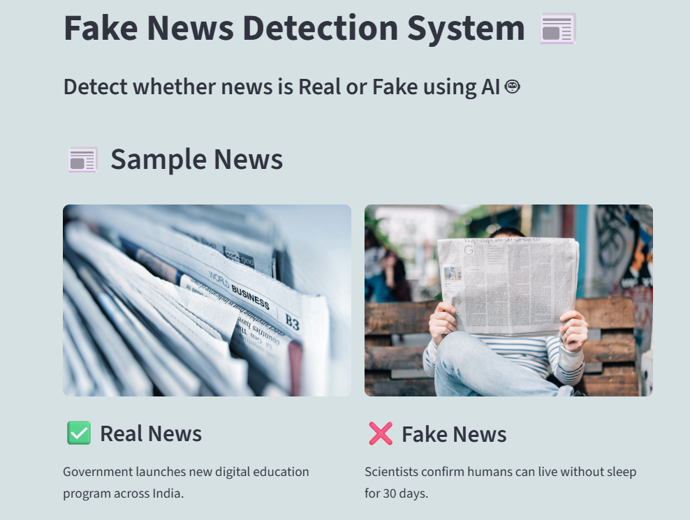
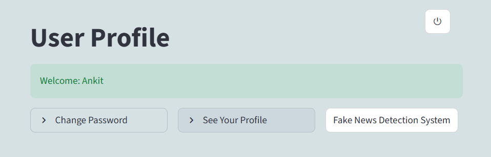
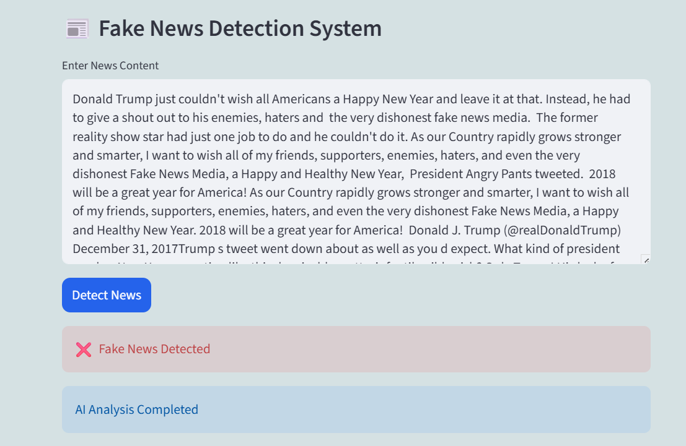

# 📰 Fake News Detection System

## 📌 About The Project

In today’s digital world, misinformation spreads rapidly across social media and online platforms.  
Our **Fake News Detection System** is designed to help users identify whether a news article is **real or fake** using Artificial Intelligence techniques.

---

# 🎯 Our Mission

Our mission is to:

- Reduce the spread of misinformation  
- Promote awareness and critical thinking  
- Provide a reliable tool for verifying news content  

---

# 🌐 Live Demo

🔗 Deployment URL: https://app-mcr.streamlit.app/

-----

# 📸 Screenshots

## 🏠 Home Page

---

## 🔐 Login Page

---

## 👤 Profile Page

---

## 🤖 Fake News Detection

-----

# 🚀 Features

- 🔐 User Login & Signup System  
- 👤 User Profile Management  
- 🔑 Change Password Feature  
- 🔍 Instant News Verification  
- 🧠 AI-Powered Prediction  
- 📊 Easy-to-Use Interface  
- ⚡ Fast and Accurate Results  
- 🗄 MongoDB Database Integration  

---

# 🛠 Technologies Used

- **Python** — Main programming language  
- **Streamlit** — Frontend web application framework  
- **MongoDB Atlas** — Cloud database storage  
- **PyMongo** — MongoDB connectivity with Python  
- **Machine Learning** — Fake news prediction model  
- **Scikit-learn** — ML model training and prediction  
- **Pickle** — Model and vector file serialization  
- **TF-IDF Vectorizer** — Text feature extraction  
- **HTML/CSS** — UI styling and customization  
- **Git & GitHub** — Version control and deployment  
- **Streamlit Cloud** — Cloud hosting and deployment  

  -----

  # 🌐 Why It Matters

Fake news can influence public opinion, create confusion, and harm society.  

Our system helps users make informed decisions by providing a quick and reliable way to verify information.

---

# 👨‍💻 Our Team

This project is developed as part of an academic initiative to explore real-world applications of Artificial Intelligence.  

We aim to continuously improve the system for better accuracy and usability.

---
